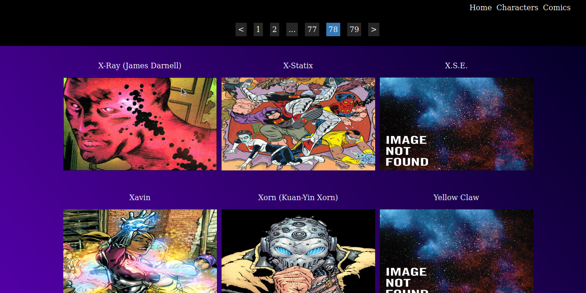
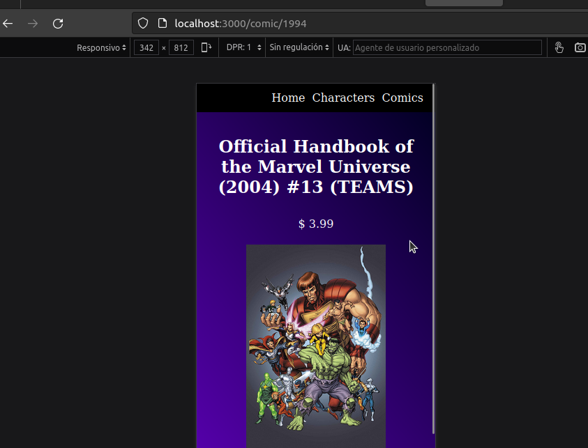
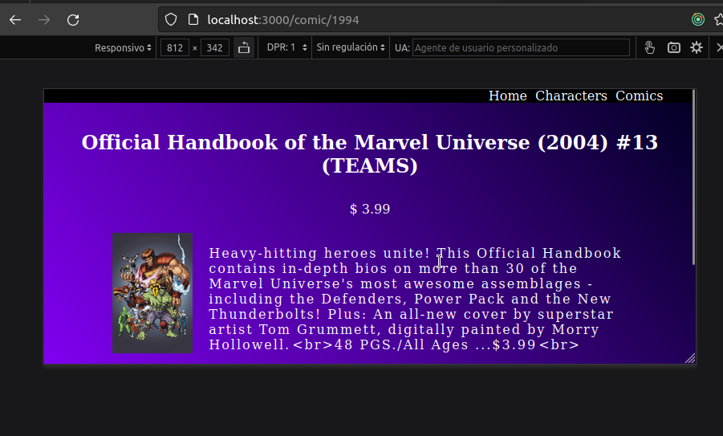

<div align="center">
    
    
    
    
    
    
    
</div>

<br>

<h1 align="center">
    Instructions
</h1>

#### Create a file .env an add this: 

```bash
VITE_MARVEL_PUBLIC_KEY=963def3c08d9f47810421fccaf47fe67
VITE_MARVEL_PRIVATE_KEY=b7bc7c4f10cf6e297811f98a4e1a21efb83d47c8
VITE_MARVEL_BASE_URL=https://gateway.marvel.com:443/v1/public
```

#### Installing Node Modules

```bash
yarn install
```

#### Starting the Application

```bash
yarn run dev
```

#### Building for Production

```bash
yarn build
```

<h1 align="center">
    For devs
</h1>

### Exectue prettier --write.

```bash
yarn run prettier
```

<br>

<h1 align="center">
    Responsive.
</h1>

| Image                                                               | Description  |
| ------------------------------------------------------------------- | ------------ |
|             | Web.         |
|       | Mobile.      |
|   | Mobile.      |

<h1 align="center">
    Architecture
</h1>

#### API Design

| Endpoint            | Page                                                                                                               | Description             |
| ------------------- | ------------------------------------------------------------------------------------------------------------------ | ----------------------- |
| _/_                 | [src/views/HomeView/HomeView.jsx](src/views/HomeView/HomeView.jsx)                                                 | Home page.              |
| _/comic_            | [src/views/ComicView/ComicView.jsx](src/views/ComicView/ComicView.jsx)                                             | List of comic view.     |
| _/comic/:id_        | [src/views/ComicDetailsView/ComicDetailsView.jsx](src/views/ComicDetailsView/ComicDetailsView.jsx)                 | Comic details view.     |
| _/character_        | [src/views/CharacterView/CharacterView.jsx](src/views/CharacterView/CharacterView.jsx)                             | List of character view. |
| _/character/:id_    | [src/views/CharacterDetailsView/CharacterDetailsView.jsx](src/views/CharacterDetailsView/CharacterDetailsView.jsx) | Character details view. |

<br>

| Api                                                            | Description                                         |
| -------------------------------------------------------------- | --------------------------------------------------- |
| [src/api/marvelApiIntance.js](src/api/marvelApiIntance.js)     | Axios instance marvel api + interceptors            |

<br>

| Layout                                                                                | Description            |
| ------------------------------------------------------------------------------------- | ---------------------- |
| [src/layout/MvCard/MvCard.jsx](src/layout/MvCard/MvCard.jsx)                          | Card component.        |
| [src/layout/MvFooter/MvFooter.jsx](src/layout/MvFooter/MvFooter.jsx)                  | Footer component.      |
| [src/layout/MvHeader/MvHeader.jsx](src/layout/MvHeader/MvHeader.jsx)                  | Header component.      |
| [src/layout/MvLink/MvLink.jsx](src/layout/MvLink/MvLink.jsx)                          | Link component.        |
| [src/layout/MvLoading/MvLoading.jsx](src/layout/MvLoading/MvLoading.jsx)              | Loading component.     |
| [src/layout/MvMain/MvMain.jsx](src/layout/MvMain/MvMain.jsx)                          | Main component.        |
| [src/layout/MvPagination/MvPagination.jsx](src/layout/MvPagination/MvPagination.jsx)  | Pagination component.  |
| [src/layout/MvSection/MvSection.jsx](src/layout/MvSection/MvSection.jsx)              | Section component.     |

<br>

| Redux                                                                                                    | Description                         |
| -------------------------------------------------------------------------------------------------------- | ----------------------------------- |
| [src/redux/actions/changeCharctersOffsetAction.js](src/redux/actions/changeCharctersOffsetAction.js)     | Change offset in pagination action. |
| [src/redux/actions/getCharacterDetailAction.js](src/redux/actions/getCharacterDetailAction.js)           | Get characters details action.      |
| [src/redux/actions/getCharactersAction.js](src/redux/actions/getCharactersAction.js)                    | Get all characters action.          |
| [src/redux/actions/getComicDetailAction.js](src/redux/actions/getComicDetailAction.js)                   | Get comics details action.          |
| [src/redux/actions/getComicsAction.js](src/redux/actions/getComicsAction.js)                             | Get all comics action.              |
| [src/redux/actions/setLoadingAction.js](src/redux/actions/setLoadingAction.js)                           | Set status loading action.          |
| [src/redux/reducers/changeCharctersOffsetReducer.js](src/redux/reducers/changeCharctersOffsetReducer.js) | Pagination offset state reducer.    |
| [src/redux/reducers/characterDetailReducer.js](src/redux/reducers/characterDetailReducer.js)             | Characters details state reducer.   |
| [src/redux/reducers/charactersReducer.js](src/redux/reducers/charactersReducer.js)                       | Characters state reducer.           |
| [src/redux/reducers/comicDetailReducer.js](src/redux/reducers/comicDetailReducer.js)                     | Comics details state reducer.       |
| [src/redux/reducers/comicsReducer.js](src/redux/reducers/comicsReducer.js)                               | Comics state reducer.               |
| [src/redux/reducers/rootReducers.js](src/redux/reducers/rootReducers.js)                                 | Combine reducers.                   |
| [src/redux/store.js](src/redux/store.js)                                                                 | Store redux.                        |
| [src/redux/types.js](src/redux/types.js)                                                                 | All types.                          |

<br>

| Routes                                                                                       | Description                  |
| -------------------------------------------------------------------------------------------- | ---------------------------- |
| [src/routes/RouteProvider/RouteProvider.jsx](src/routes/RouteProvider/RouteProvider.jsx)     | React router dom provider.   |

<br>

| Style                                            | Description                    |
| ------------------------------------------------ | ------------------------------ |
| [src/style/style.scss](src/style/style.scss)     | Sass style manage all imports. |

<br>

| views                                                                                                               | Description                  |
| ------------------------------------------------------------------------------------------------------------------- | ---------------------------- |
| [src/views/CharacterDetailsView/CharacterDetailsView.jsx](src/views/CharacterDetailsView/CharacterDetailsView.jsx)  | Character details view.      |
| [src/views/CharacterView/CharacterView.jsx](src/views/CharacterView/CharacterView.jsx)                              | Character view.              |
| [src/views/ComicDetailsView/ComicDetailsView.jsx](src/views/ComicDetailsView/ComicDetailsView.jsx)                  | Comics details view.         |
| [src/views/ComicView/ComicView.jsx](src/views/ComicView/ComicView.jsx)                                              | Comics view.                 |
| [src/views/HomeView/HomeView.jsx](src/views/HomeView/HomeView.jsx)                                                  | Landing page.                |


<br>
<hr>
<br>

<p align='center'></p>